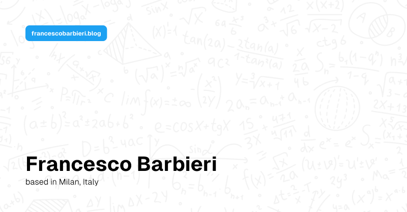

## francescobarbieri.blog

My current personal websites repository. Available at [francescobarbieri.blog](https://francescobarbieri.blog).

## Overview

- `/` - Home page.
- `/essays` - List of essays page. 
- `/essays/[slug]`- Single essay page, served with [Contentful](https://Contentful.com).
- `/reading-list` - Recommended reading page.
- `/api` - API routes.

## Credits

- Special tanks to [onur.dev](https://github.com/suyalcinkaya/onur.dev) for the open-source design inspiration. Since I'm not a designer, I've incorporated elements of his design into this project - mainly in the navbar - to enhance its visual appeal and functionality.

## Built With

- Framework: [Next.js](https://nextjs.org)
- Components: [shadn/ui](https://ui.shadcn.com/)
- Components: [Emil Kowalski](https://emilkowal.ski/)
- Content: [Contentful](https://Contentful.com)
- Database: [Supabase](https://supabase.com)
- Deployment: [Vercel](https://vercel.com)
- Styling: [Tailwind CSS](https://tailwindcss.com)
- Analytics: [Vercel Analytics](https://vercel.com)
